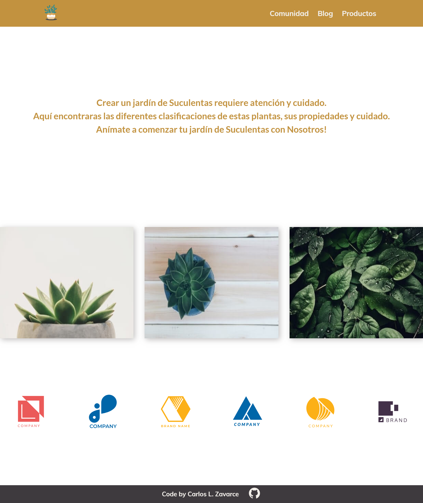
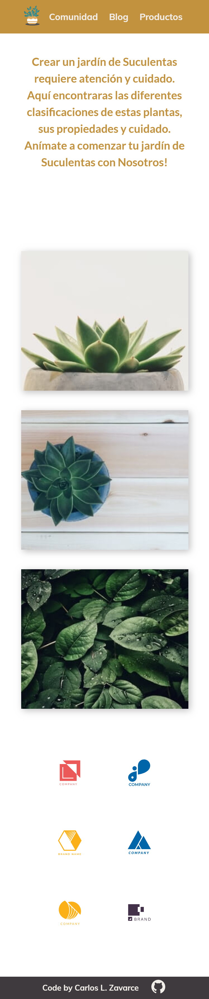

# Suculentagram
📝This is my SPA using pure Vanilla Js.

😍 I build this project for practice everything, that i learn in Platzi.com

🙏I use Pexel-Api to consume resources and build this project.
**The purpose of this challenge is: continues with my learn about HTML , CSS and JS**

## Start 🚀

_Only you need to download the files and run install to setup all dependencies._

```
npm install
```

Now **Deployment** try run this script to see the project on your computer.

```
npm start
```
_Now see the project in_ **localhost:4000**

## Preview :art:

You can see the live result here → [Demo](https://krlosaren.github.io/Suculentagram/)

🖥 Desktop version



📱 Mobile version



## :pill: Technologies
1. HTML
2. CSS
3. Sass
4. JavaScript
4. Webpack
5. Travis
